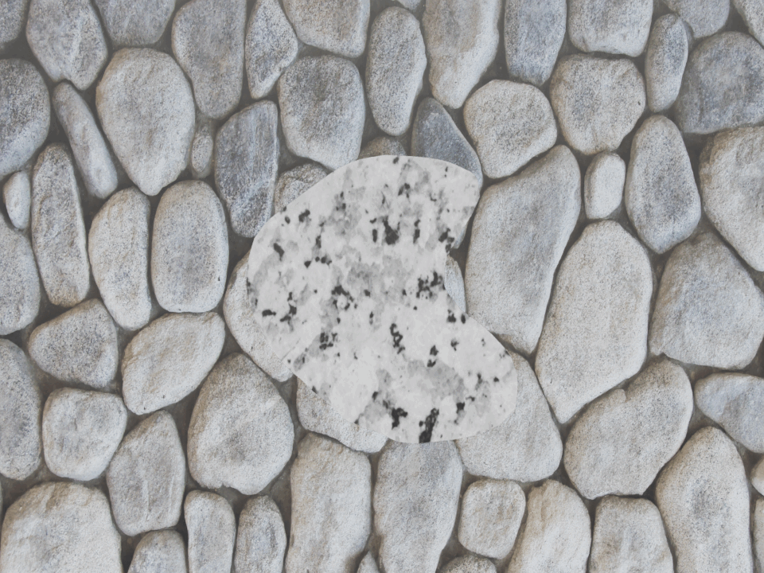
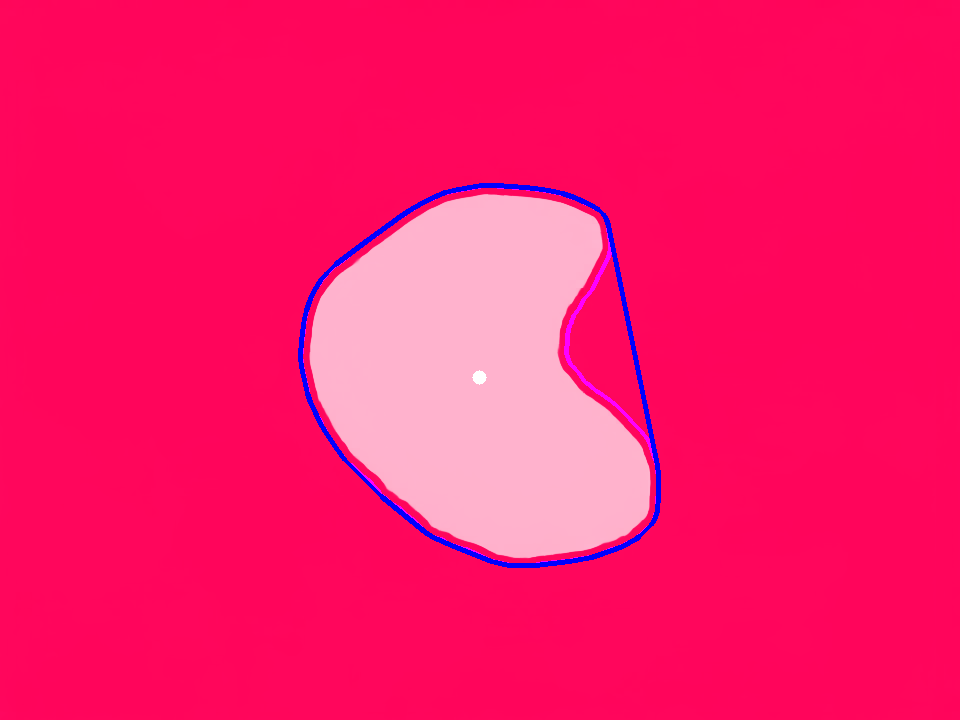
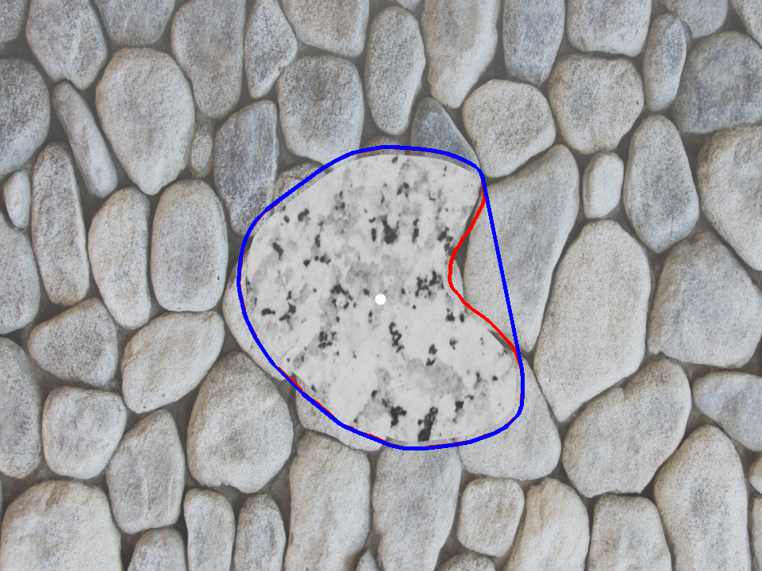
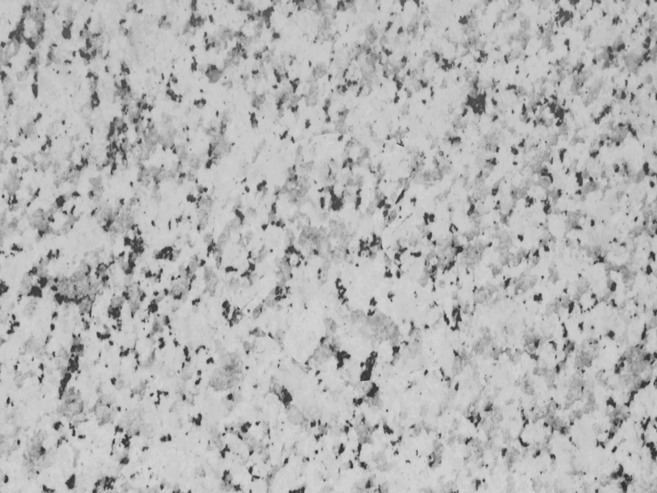
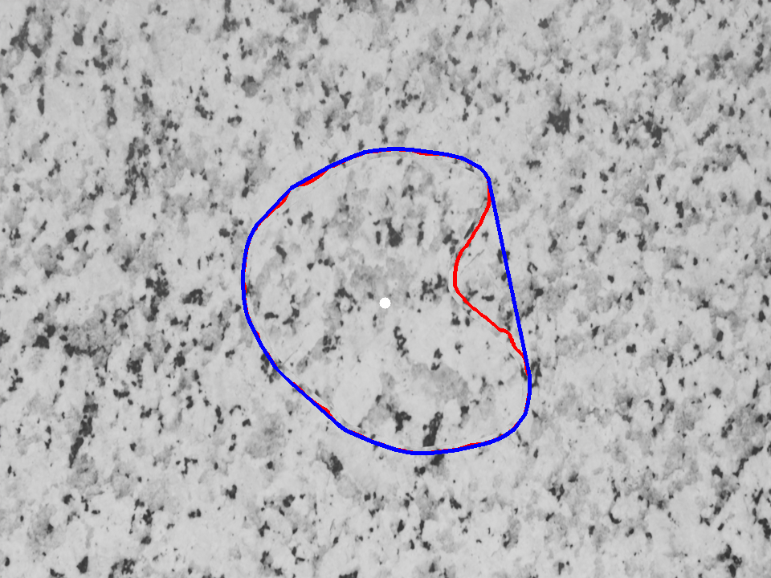

# Optical flow based structure-less gap detection for drone flight -
In this project a perception stack for the DJI Tello EDU quadcopter is designed to enabe it to autonomously
navigate through irregular, unknown-shaped windows. The primary goal is to identify and fly through the largest gap in a wall. The process begins by maneuvering the quadcopter to a position where the full gap is visible, followed by detecting the optical flow of the window. Subsequently, this flow data is postprocessed
to outline the largest gap’s contour and pinpoint its center. With the center identified we employ visual servoing to guide the quadcopter to align its image center with the gap’s center, facilitating a successful flight through the gap.

(Check the full problem statements here [project 4](https://rbe549.github.io/rbe595/fall2023/proj/p4/))


## Steps to run the code
- Install Numpy, OpenCV, djitellopy, torch, cudatoolkit, matplotlib libraries before running the code.
- Install all the library dependencies mentioned [here](https://github.com/princeton-vl/RAFT)
- Turn the drone on and connect to it.
- To run the main code run the `Wrapper.py` file after installing all dependancies. This will save the final output in `Code` folder itself.
- In Code folder:
  ```bash
  python3 Wrapper.py --model=RAFT/models/raft-sintel.pth
  ```
- In our testing we found the weights for sintel dataset are giving better results. Try other weights if you want to by changing the weight file accordingly.

## Report
For detailed description see the report [here](Report.pdf).

## Plots and Animations
### Blender simulation
Testing the flow detection in blender simulation:

Case 1:
<p float="middle">
	 
	
	
</p>

Case 2:
<p float="middle">
	 
	
	
</p>

### Real world run
Gaussian splat of the real window in the lab:

<p float="middle">
	
</p>

Live demo runs:
Watch the good quality video of demo run 1 on the real tello drone here ([link1](https://youtu.be/wt_jdC7YsPk) and [link2](https://youtu.be/kCroe-EPg3U)).

<p float="middle">
	 
	
</p>

Watch the good quality video of demo run 2 on the real tello drone here ([link1](https://youtu.be/JmVFpYKcHsI) and [link2](https://youtu.be/AGB9YBB8y6k)).

<p float="middle">
	 
	
</p>

## Collaborators
Chaitanya Sriram Gaddipati - cgaddipati@wpi.edu

Shiva Surya Lolla - slolla@wpi.edu

Ankit Talele - amtalele@wpi.edu


  
